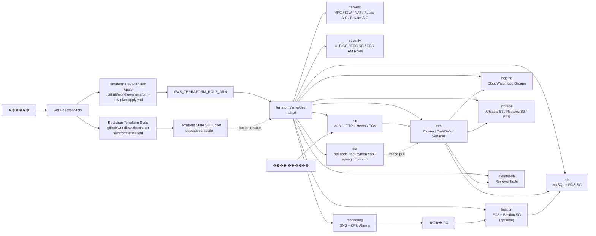
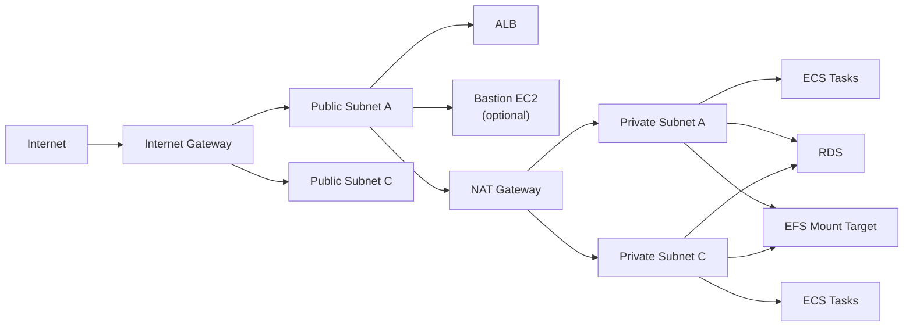
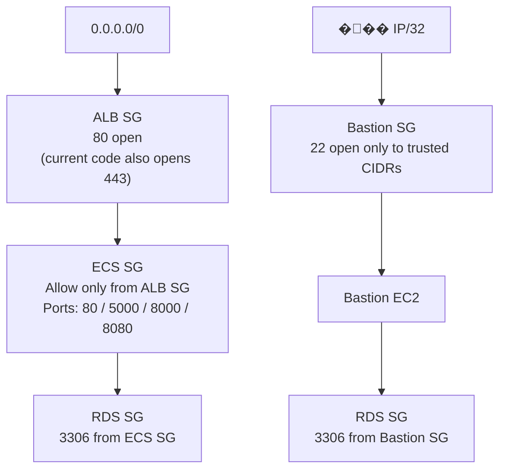
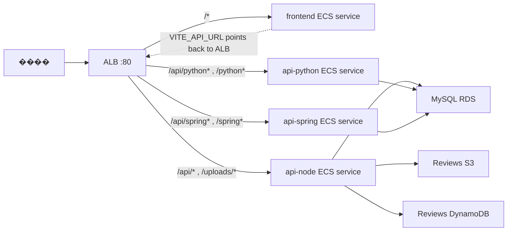
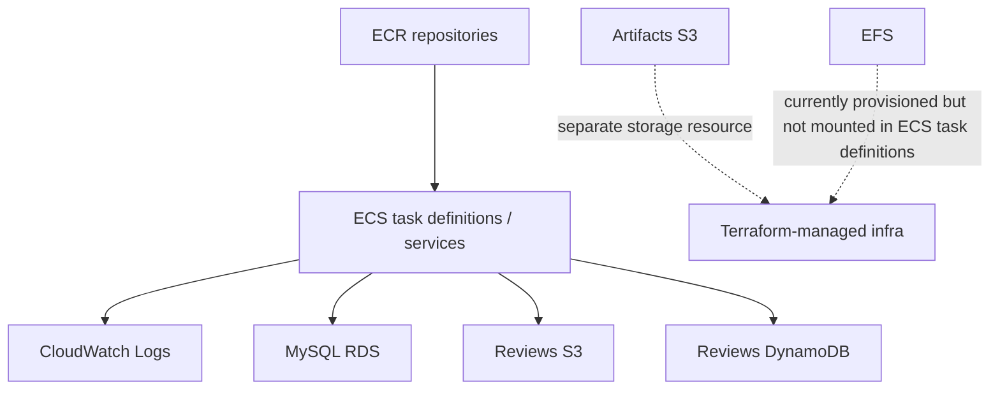

# Terraform Architecture Visualization

�� ������ ���� Terraform �ڵ� ��������, �����ں��� �������� �̾����� ��ü �帧�� �ð������� ������ ������.
���� �������� `terraform/envs/dev/main.tf` �̰�, `prod`�� ���� ���� ������ ������.

## 1. End-to-End Overview

## 2. Terraform Composition Map

```mermaid
flowchart TD
    Env["terraform/envs/dev/main.tf"]

    Env --> Network
    Env --> Security
    Env --> Bastion
    Env --> ECR
    Env --> Logging
    Env --> ALB
    Env --> Storage
    Env --> DDB
    Env --> RDS
    Env --> ECS
    Env --> Monitoring

    Network --> VPC["VPC"]
    Network --> IGW["Internet Gateway"]
    Network --> NAT["NAT Gateway in Public-A"]
    Network --> PubA["Public-A"]
    Network --> PubC["Public-C"]
    Network --> PriA["Private-A"]
    Network --> PriC["Private-C"]

    Security --> ALBSG["ALB SG"]
    Security --> ECSSG["ECS SG"]
    Security --> ExecRole["ecs task execution role"]
    Security --> TaskRole["ecs task role"]

    Bastion --> BastionEC2["Bastion EC2"]
    Bastion --> BastionSG["Bastion SG"]

    ALB --> ALBRes["ALB"]
    ALB --> Listener["HTTP :80 Listener"]
    ALB --> TGs["Target Groups"]

    Storage --> ArtifactS3["Artifacts S3"]
    Storage --> ReviewS3["Reviews S3"]
    Storage --> EFS["EFS + Mount Targets"]

    DDB --> ReviewsTable["Reviews DynamoDB Table"]

    RDS --> DBSG["RDS SG"]
    RDS --> MySQL["MySQL RDS"]

    ECS --> Cluster["ECS Cluster"]
    ECS --> TaskDefs["Task Definitions"]
    ECS --> Services["Services\nfrontend / api-node / api-python / api-spring"]

    Logging --> LogGroups["CloudWatch Log Groups"]
    ECR --> Repos["ECR Repositories"]
    Monitoring --> SNS["SNS Topic"]
    Monitoring --> Alarms["Per-service CPU Alarms"]
```

## 3. Network Layout

## 4. Security Group Chaining

## 5. Customer Request Flow

## 6. Data / Image / Logs Flow

## 7. Current Module Responsibilities

| Module | Main responsibility |
| --- | --- |
| `network` | VPC, IGW, NAT, public/private subnets, route tables |
| `security` | ALB SG, ECS SG, ECS execution/task IAM roles |
| `bastion` | Bastion EC2 and Bastion SG in Public-A |
| `alb` | ALB, HTTP listener, target groups, listener rules |
| `ecs` | ECS cluster, task definitions, ECS services |
| `ecr` | Container image repositories and lifecycle policies |
| `logging` | CloudWatch log groups per service |
| `storage` | Artifacts S3, Reviews S3, EFS |
| `dynamodb` | Reviews DynamoDB table |
| `rds` | MySQL RDS, DB subnet group, RDS SG |
| `monitoring` | SNS topic and ECS CPU alarms |

## 8. Important Notes

- Bastion�� `bastion_key_name` �� `bastion_ingress_cidrs` �� �� ������ ��쿡�� �����ȴ�.
- ���� ALB �����ʴ� HTTP `80`�� ����Ѵ�. �ٸ� ALB SG�� `443`�� ����� ���´�.
- EFS�� ����������, ���� ECS task definition���� volume mount�� ����Ǿ� ���� �ʴ�.
- `terraform/bootstrap` �� ��Ÿ�� ������ �ƴ϶� Terraform remote state bucket�� ����� ���� ���� �ܰ��.
- `dev` �� `prod` �� ���� ��� ������ �����ϰ�, �ַ� �̸� prefix / CIDR / desired_count ���� ���� �޶�����.
